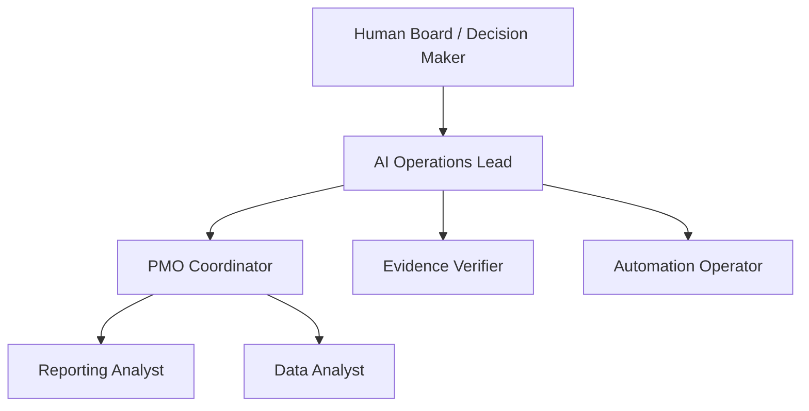

# RA Agent Operations Control Tower

A recruiter-facing demonstration of AI-workforce governance through an Operations / PMO lens.

## What this demonstrates
- role clarity and reporting lines;
- budget controls;
- RAG health;
- workload and blocked-task visibility;
- heartbeat monitoring;
- evidence-first governance;
- human oversight over automated work.

This is a synthetic portfolio case study. It does not claim a production autonomous company or proprietary Paperclip implementation.
